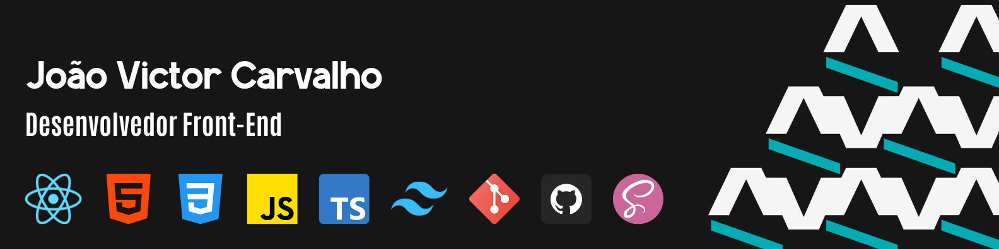

# 

## 👋 Olá, bem-vindo(a) ao meu GitHub!

Sou **João Victor**, desenvolvedor **Front-End** focado em criar interfaces modernas, intuitivas e voltadas para a melhor experiência do usuário.

---

### 🌐 Conecte-se comigo

---

## 📝 Sobre Mim

Sou um desenvolvedor em constante evolução, com experiência em **HTML, CSS, JavaScript e React.js**, e conhecimentos complementares em **TailwindCSS, Bootstrap, SASS, Git e TypeScript**.  
Entusiasta em criar interfaces **responsivas, acessíveis e de alta performance**, e busco aplicar as melhores práticas para garantir qualidade e eficiência nos projetos.

---

## 🛠 Tecnologias & Ferramentas

  
  
  
  
  
  
  
  
  
  
  

---

## 📊 Estatísticas no GitHub

  
  

